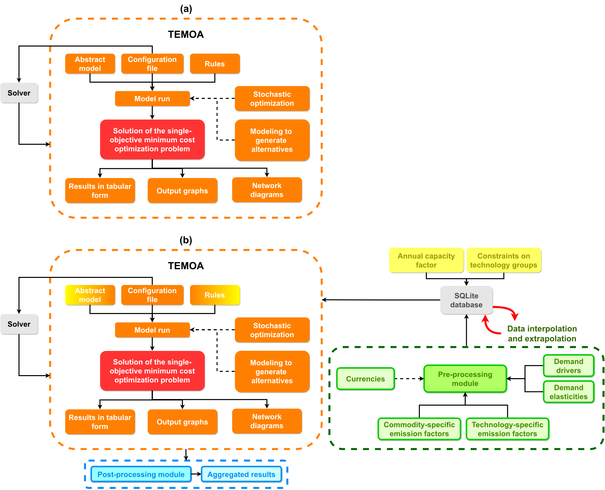

# TEMOA
## Model features

This is an extended version of the [TEMOA](https://temoacloud.com/) (Tools for Energy Modeling Optimization and Analysis) energy system modeling framework.

The development team currently includes [Matteo Nicoli](http://www.mahtep.polito.it/people/phd_students/nicoli_matteo), [Gianvito Colucci](http://www.mahtep.polito.it/people/phd_students/colucci_gianvito), [Daniele Lerede](http://www.mahtep.polito.it/people/phd_students/lerede_daniele) and Prof. [Laura Savoldi](http://www.mahtep.polito.it/people/head/savoldi_laura) from [MAHTEP Group](http://www.mahtep.polito.it/) at [Department of Energy](https://www.denerg.polito.it/en/) of [Politecnico di Torino](https://www.polito.it/). For any communication related to our TEMOA version, please write to [matteo.nicoli@polito.it](mailto:matteo.nicoli@polito.it).

Figure 1 schematically shows the main differences between the [original TEMOA](https://github.com/TemoaProject/temoa) version and the MAHTEP version.


*Figure 1. Original (a) and extended (b) TEMOA structure.*

The main changes between the two versions concern:
* Integration of new parameters and constraints in the TEMOA algorithm, as explained in [1].
* Development of a database pre-processing module, whom functions are explained in [1].
* Development of a database post-processing module, to derive aggregated results by technologies, commodities, and groups of them.

The public model instances based on this TEMOA version are:
* [TEMOA-Italy](https://github.com/MAHTEP/TEMOA-Italy)
* [TEMOA-Europe](https://github.com/MAHTEP/TEMOA-Europe)

Below, the list of publications in which this version was used:
1. M. Nicoli, F. Gracceva, D. Lerede, and L. Savoldi, “Can We Rely on Open-Source Energy System Optimization Models? The TEMOA-Italy Case Study,” Energies (Basel), vol. 15, no. 18, p. 6505, Sep. 2022, doi: 10.3390/en15186505.
2. M. Nicoli, A TIMES-like open-source model for the Italian energy system. Turin, 2021. Accessed: Jul. 05, 2022. [Online]. Available: https://webthesis.biblio.polito.it/18850/
3. G. Colucci, D. Lerede, M. Nicoli, and L. Savoldi, “A dynamic accounting method for CO2 emissions to assess the penetration of low-carbon fuels: application to the TEMOA-Italy energy system optimization model,” Appl Energy, vol. 352, no. 121951, Dec. 2023, doi: 10.1016/j.apenergy.2023.121951.
4. G. Colucci, D. Lerede, M. Nicoli, and L. Savoldi, “Dynamic Accounting for End-Use CO2 Emissions From Low-Carbon Fuels in Energy System Optimization Models,” Energy Proceedings, 2022, doi: 10.46855/energy-proceedings-10294.
5. A. Balbo, G. Colucci, M. Nicoli, and L. Savoldi, “Exploring the Role of Hydrogen to Achieve the Italian Decarbonization Targets Using an Open-Source Energy System Optimization Model,” in International Journal of Energy and Power Engineering, E. and T. World Academy of Science, Ed., Mar. 2023, pp. 89–100. Accessed: Apr. 24, 2023. [Online]. Available: https://publications.waset.org/10013040/exploring-the-role-of-hydrogen-to-achieve-the-italian-decarbonization-targets-using-an-open-source-energy-system-optimization-model
6. A. Balbo, “Will hydrogen be a game-changer in the Italian decarbonization pathways? Exploiting an Energy System Optimization Model for scenario analysis,” Politecnico di Torino, 2022. Accessed: Feb. 11, 2023. [Online]. Available: https://webthesis.biblio.polito.it/24983/
7. M. E. Alfano, “Modeling the Energy and the Water Systems in an open-access Energy System Optimization Model: the Pantelleria case study,” Politecnico di Torino, 2022. Accessed: Jan. 19, 2023. [Online]. Available: https://webthesis.biblio.polito.it/24982/
8. D. Lerede, “Development of an open-source and open-data energy system optimization model for the analysis of the European energy mix,” pp. 1–178, Mar. 2023, Accessed: May 04, 2023. [Online]. Available: https://iris.polito.it/handle/11583/2978154

# Overview

The 'energysystem' branch is the current master branch of
Temoa.  The four subdirectories are:

1. `temoa_model/`
Contains the core Temoa model code.

2. `data_files/`
Contains simple input data (DAT) files for Temoa. Note that the file 
'utopia-15.dat' represents a simple system called 'Utopia', which 
is packaged with the MARKAL model generator and has been used 
extensively for benchmarking exercises.

3. `data_processing/`
Contains several modules to make output graphs, network diagrams, and 
results spreadsheets.

3. `tools/`
Contains scripts used to conduct sensitivity and uncertainty analysis. 
See the READMEs inside each subfolder for more information.

4. `docs/`
Contains the source code for the Temoa project manual, in reStructuredText
(ReST) format.

## Creating a Temoa Environment

Temoa requires several software elements, and it is most convenient to create 
a conda environment in which to run the model. To begin, you need to have conda 
installed either via miniconda or anaconda. Next, download the environment.yml file, 
and  place in a new directory named 'temoa-py3.' Create this new directory in 
a location where you wish to store the environment. From the command line:

```$ conda env create```

Then activate the environment as follows:

```$ source activate temoa-py3```

This new conda environment contains several elements, including Python 3, a 
compatible version of Pyomo, matplotlib, numpy, scipy, and two free solvers 
(GLPK and CBC). A note for Windows users: the CBC solver is not available for Windows through conda. Thus, in order to install the environment properly, the last line of the 'environment.yml' file specifying 'coincbc' should be deleted.

To download the Temoa source code, either clone the repository or download from GitHub 
as a zip file.

## Running Temoa

To run Temoa, you have a few options. All commands below should be executed from the 
top-level 'temoa' directory.

**Option 1 (full-featured):**
Invokes python directly, and gives the user access to 
several model features via a configuration file:

```$ python  temoa_model/  --config=temoa_model/config_sample```

Running the model with a config file allows the user to (1) use a sqlite 
database for storing input and output data, (2) create a formatted Excel 
output file, (2) specify the solver to use, (3) return the log file produced during model execution, (4) return the lp file utilized by the solver, and (5) to execute modeling-to-generate alternatives (MGA). Note that if you do not have access to a commercial solver, it may be faster run cplex on the NEOS server. To do so, simply specify cplex as the solver and uncomment the '--neos' flag.


**Option 2 (basic):**
Uses Pyomo's own scripts and provides basic solver output:

```$ pyomo solve --solver=<solver> temoa_model/temoa_model.py  path/to/dat/file```

This option will only work with a text ('DAT') file as input. 
Results are placed in a yml file within the top-level 'temoa' directory.


**Option 3 (basic +):**
Copies the relevant Temoa model files into an executable archive 
(this only needs to be done once):

```$ python create_archive.py```

This makes the model more portable by placing all contents in a 
single zipped file. Now it is possible to execute the model with the 
following simply command:

```$ python temoa.py  path/to/dat/file```

For general help use --help:

```$ python  temoa_model/  --help```


